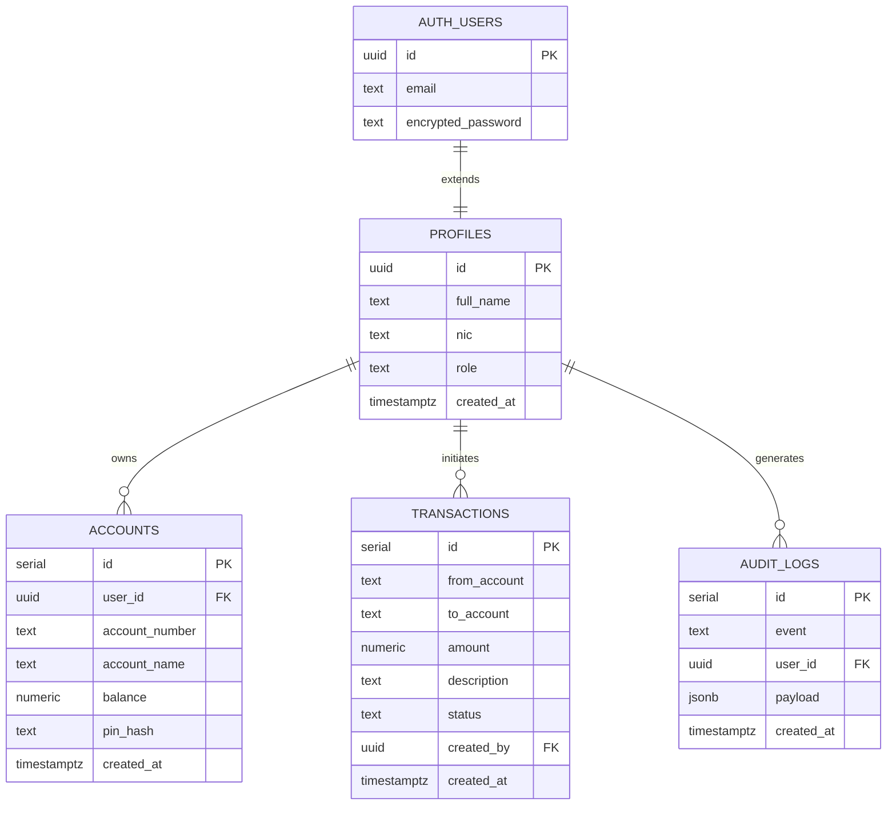
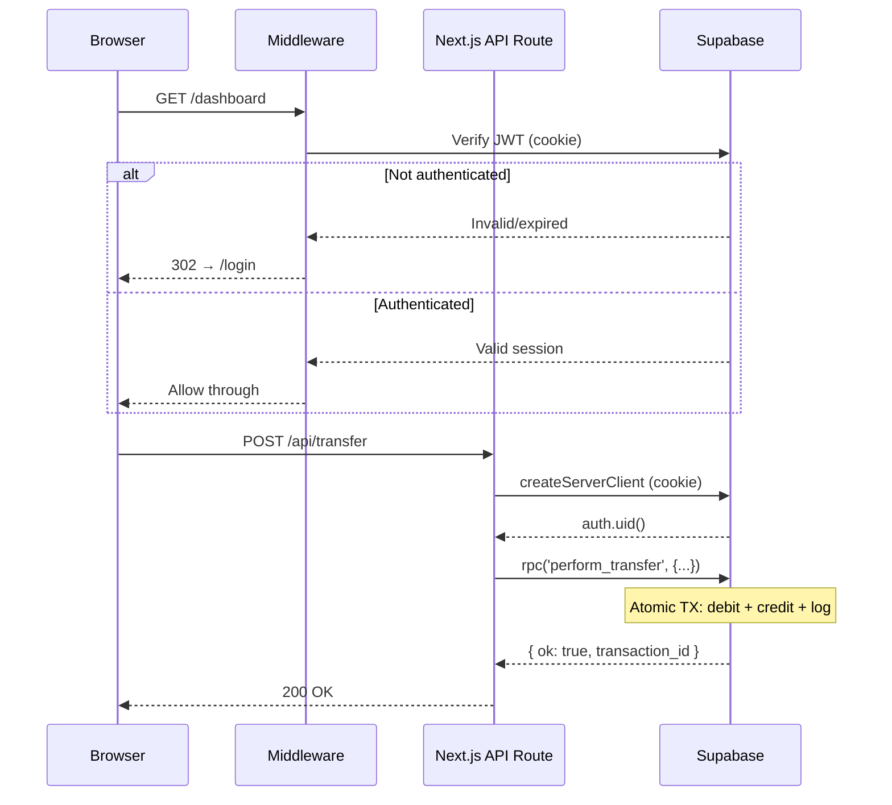
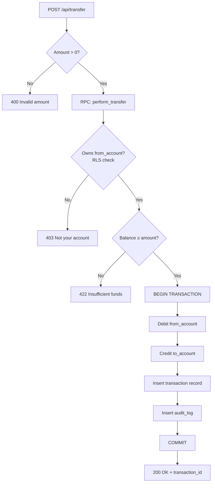
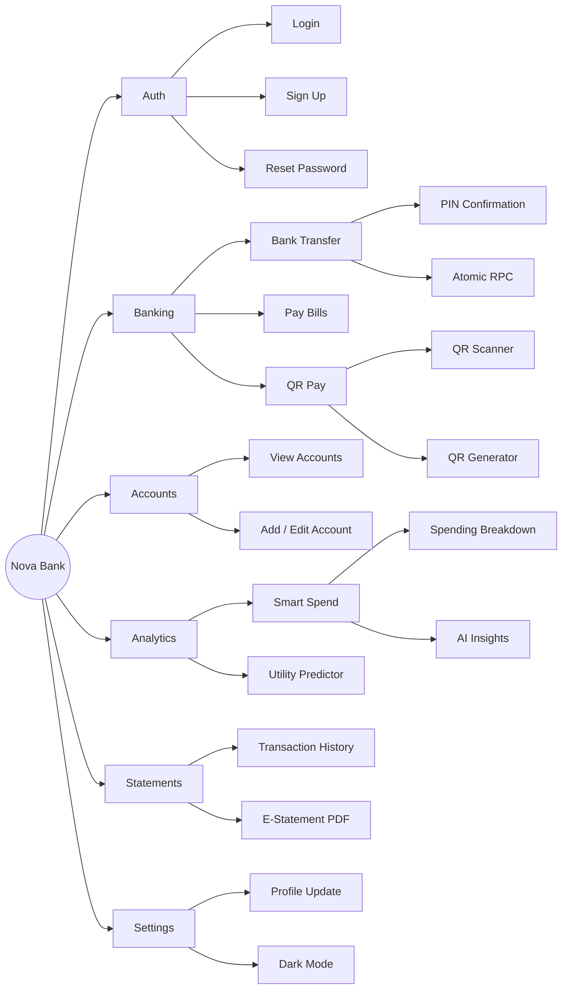
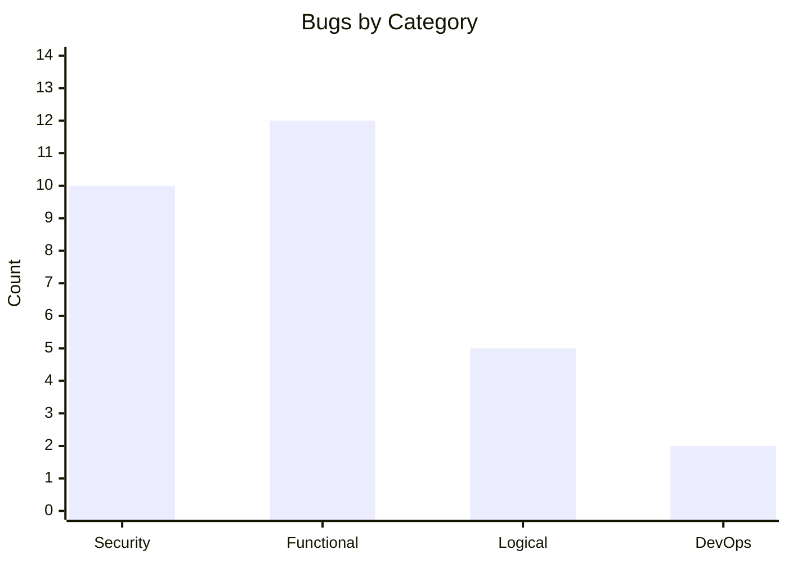

# Nova Bank - Architecture Document

**Hack to Night 2026** | Team: Neo, Gimhani, Zenith, Ruwithma  
**Stack:** Next.js 16 · Supabase · TypeScript · Tailwind CSS · shadcn/ui

---

## System Overview

```mermaid
graph TD
    User["👤 User (Browser)"]

    subgraph Frontend["Next.js 16 App Router"]
        Auth["Auth Pages\n/login · /sign-up · /reset-password"]
        Dashboard["/dashboard"]
        Transfer["/bank-transfer"]
        Bills["/pay-bills"]
        Accounts["/bank-accounts"]
        Txns["/transactions"]
        EStmt["/e-statement"]
        SmartSpend["/smart-spend"]
        QR["/qr-pay"]
        Settings["/settings"]
        MW["middleware.ts\n(Route Protection)"]
    end

    subgraph APILayer["API Routes (Next.js)"]
        TransferAPI["/api/transfer"]
        AccountsAPI["/api/accounts"]
        TxnsAPI["/api/transactions"]
        ProfileAPI["/api/profile"]
        SearchAPI["/api/search"]
        InsightsAPI["/api/insights"]
        PayReqAPI["/api/payment-requests"]
        SplitsAPI["/api/splits"]
        UtilAPI["/api/utility-predictor"]
    end

    subgraph Supabase["Supabase (Backend-as-a-Service)"]
        SupaAuth["Auth\n(JWT · bcrypt · email confirm)"]
        Postgres["PostgreSQL\n(RLS enabled)"]
        Realtime["Realtime\n(balance updates)"]
    end

    OpenAI["OpenAI API\n(Smart Spend · Utility Predictor)"]

    User -->|HTTPS| MW
    MW -->|Protected routes| Frontend
    MW -->|Unauthenticated| Auth
    Auth -->|supabase.auth.*| SupaAuth
    Frontend -->|fetch()| APILayer
    APILayer -->|supabase client| Postgres
    APILayer -->|supabase.auth| SupaAuth
    Postgres -->|Realtime sub| Realtime
    Realtime -->|WebSocket| Dashboard
    InsightsAPI -->|API call| OpenAI
    UtilAPI -->|API call| OpenAI
```

---

## Database Schema



---

## Authentication & Request Flow



---

## Transfer Transaction (Atomic RPC)



---

## Security Model

| Layer | Mechanism | Bugs Fixed |
|---|---|---|
| **Auth** | Supabase JWT (signed, HttpOnly cookie) | S5 - forgeable sessions |
| **Passwords** | bcrypt via Supabase Auth | S6 - plaintext passwords |
| **Queries** | Supabase JS client (parameterized) | S1 - SQL injection (all routes) |
| **Data Access** | Row Level Security on all tables | S4, L4 - PIN exposure, ownership bypass |
| **Routes** | Next.js middleware JWT check | F2 - unprotected pages |
| **Secrets** | Env vars only (no hardcoded creds) | S10 - hardcoded credentials |
| **API Errors** | Generic `{ ok: false, message }` | S7, S8, S9 - internal leaks |

---

## Feature Map



---

## Bugs Fixed Summary

**29 bugs found → 10 auto-fixed by Supabase migration, 19 manually resolved**



| Category | Critical | High | Medium | Low |
|---|---|---|---|---|
| Security | 6 | 2 | 1 | 0 |
| Functional | 1 | 6 | 4 | 0 |
| Logical | 4 | 0 | 1 | 0 |
| DevOps | 0 | 0 | 1 | 1 |

---

## Tech Stack

| Layer | Technology |
|---|---|
| **Framework** | Next.js 16 (App Router) |
| **Language** | TypeScript |
| **Styling** | Tailwind CSS v4 + shadcn/ui |
| **Auth & DB** | Supabase (PostgreSQL + RLS + Auth) |
| **AI** | OpenAI API (insights, utility predictor) |
| **Charts** | Recharts |
| **Forms / Validation** | Zod |
| **PDF Export** | jsPDF + jspdf-autotable |
| **QR** | qrcode + qr-scanner |
| **Containerisation** | Docker + Docker Compose |
| **Linting** | Biome |
